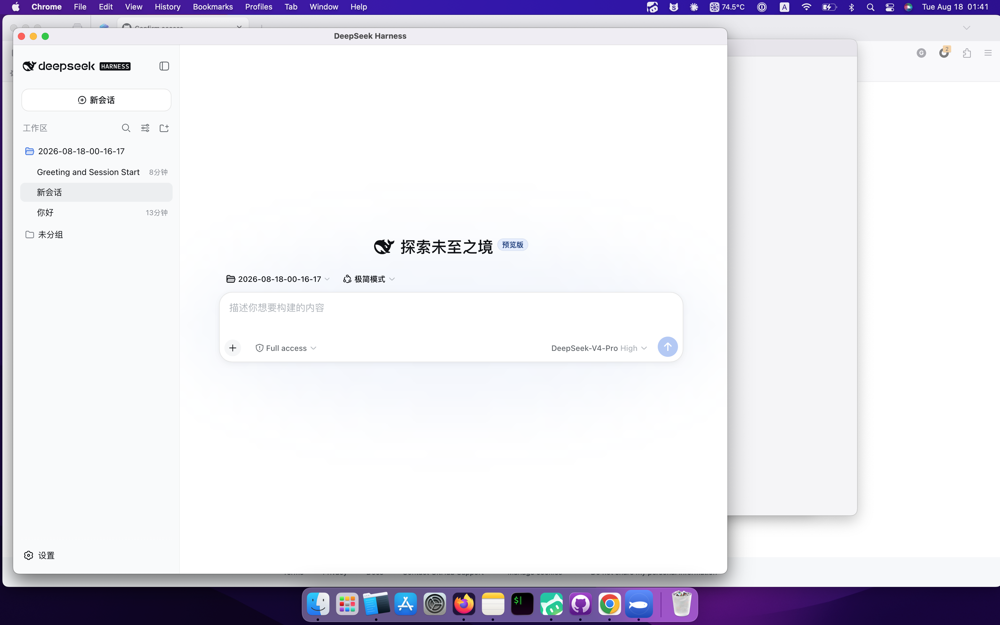

# dsh — DeepSeek Harness 桌面版

把 [DeepSeek Harness](https://github.com/deepseek-ai/deepseek-harness)（`dsh`）打包成 macOS 应用：双击启动后常驻**菜单栏右上角**（不占 Dock），自动拉起本地 `dsh web` 服务，并在 **Chrome 独立窗口**（`--app` 模式，无地址栏、无标签栏）里打开 Web UI。



> ⚠️ **开发者预览**：`dsh` 本身处于 developer preview，接口可能发生破坏性变更。本项目只是它的桌面外壳。

## ✨ 特性

- **菜单栏常驻**：双击后不弹窗口，只在右上角菜单栏显示一个鲸鱼图标；点它弹出菜单（打开 dsh / 在浏览器打开 / 退出）。`NSApp.setActivationPolicy(.accessory)`，不占 Dock。
- **一键打开**：自动定位 Node → 拉起 `dsh web`（默认 `127.0.0.1:3080`）→ 在 Chrome 独立窗口（app 模式，960×680，无地址栏/标签栏）弹出 dsh。
- **macOS 12 兼容模式**：macOS 12 的 WKWebView（Safari 15 引擎）缺正则 lookbehind 等现代特性，无法渲染 dsh 前端；本应用改用 Chrome 的 `--app` 模式开一个独立窗口，Chromium 引擎完整支持 dsh 需要的现代特性。
- **优雅退出**：菜单栏「退出」或关闭时向子进程发送 `SIGTERM`，让 dsh 干净收尾。
- **标准尺寸图标**：鲸鱼剪影 + DeepSeek 蓝渐变，squircle 四周留透明边距（约 80%，与系统图标一致），随源码一起生成。
- **内置运行时**：`@deepseek-ai/dsh` 及全部依赖被打进 `.app`，离线可用。

## 📋 环境要求

| 依赖 | 版本 | 说明 |
| --- | --- | --- |
| macOS | ≥ 12.0 | `LSMinimumSystemVersion` |
| Xcode Command Line Tools | 任意 | 提供 `swiftc` |
| Node.js | **≥ 20.12** | dsh 依赖 `util.parseEnv`，低版本会报 `SyntaxError` |
| Google Chrome | 任意现代版本 | 用 Chrome `--app` 弹出独立窗口；如未装 Chrome 会回退到系统默认浏览器 |

> 应用启动时会自动在 `/usr/local/bin`、`/opt/homebrew/bin` 等处探测可用的 Node，并校验版本 ≥ 20.12。

## 🚀 快速开始

### 方式一：直接构建并安装

```bash
git clone https://github.com/gchan2/deepseek-harness-desktop.git
cd deepseek-harness-desktop

# 构建 .app（首次会自动 npm install 拉取 dsh + 生成图标）
./build.sh --install
```

构建完成后应用会出现在「应用程序」（`/Applications/dsh.app`）。双击运行：右上角菜单栏出现鲸鱼图标，后台拉起服务并在 Chrome 独立窗口弹出 dsh。

### 方式二：只构建、不安装

```bash
./build.sh
# 产物：./dsh.app 和 ./dist/dsh.app
open ./dsh.app
```

## 🧱 工作原理

```
dsh.app（菜单栏 App，.accessory，不占 Dock）
├─ 启动
├─ 右上角菜单栏显示鲸鱼图标（NSStatusItem + 菜单）
├─ 探测 Node（≥ 20.12）
├─ spawn: node bin-wrapper.mjs web
│    └─ 动态 import @deepseek-ai/dsh/lib/bin.js（"web" profile）
├─ 轮询 127.0.0.1:3080 直到端口就绪
└─ spawn: Google Chrome --app=http://127.0.0.1:3080 --window-size=960,680 --new-window
     └─ Chrome 复用现有进程创建无地址栏独立窗口
```

退出（菜单栏图标 →「退出并停止服务」）→ `SIGTERM` → dsh 触发自身 shutdown → 子进程结束。

## 🧩 目录结构

```
.
├── build.sh              # 一键构建脚本（自举：装依赖 → 编译 → 出图 → 打包 → 签名）
├── src/
│   ├── main.swift        # 菜单栏壳：NSStatusItem + 进程管理 + Chrome --app 唤起
│   └── makeicon.swift    # 用 NSBezierPath 绘制鲸鱼图标（主图标 + 菜单栏 template 图标）
├── dsh/
│   ├── package.json      # 声明 @deepseek-ai/dsh 依赖
│   ├── package-lock.json
│   └── bin-wrapper.mjs   # 信号安全启动器（见下方「技术细节」）
├── docs/screenshot.png   # README 截图
└── LICENSE
```

## 🔧 技术细节（踩坑记录）

1. **Node 版本门槛**：`@deepseek-ai/dsh-app-boot` 使用了 `import { parseEnv } from "node:util"`，这是 Node 20.12 才引入的 API。`main.swift` 里的 `findNode()` 会对候选 node 逐个执行 `-p process.versions.node` 并拒绝 `< 20.12` 的版本。

2. **`NODE_OPTIONS` 干扰**：GUI 父进程可能携带 `NODE_OPTIONS=--use-system-ca` 之类环境变量，这类 flag 在 Node 19+ 不允许通过 `NODE_OPTIONS` 注入，会导致子进程直接报错。启动器会显式 `removeValue(forKey: "NODE_OPTIONS")`（以及 `NODE_PATH`、`NODE_EXTRA_CA_CERTS`）。

3. **dsh 的 SIGINT 自杀行为**：`@deepseek-ai/dsh/lib/profile-boot-*.js` 注册了
   `process.on("SIGINT", () => interrupt(130))`——一旦子进程收到 SIGINT（终端/进程组残留信号），就会主动 `exit(130)`。`bin-wrapper.mjs` 通过 monkey-patch `process.on` / `process.addListener` 把 SIGINT / SIGHUP 的注册回调丢弃（只保留一个空监听器防止 Node 默认退出），但**保留 SIGTERM**，让 GUI 主动退出时 dsh 仍能干净清理。

4. **macOS 12 的 WKWebView 不支持正则 lookbehind**：dsh 前端用 shiki 做代码高亮，TextMate 语法里有数百处 `(?<=...)` / `(?<!...)`（vendor 包里 719 处），而 Safari 15 不支持 lookbehind（Safari 16.4+ 才有），导致 `SyntaxError: Invalid regular expression: invalid group specifier name` 把 `conversation.chat.node` slot 渲染搞挂，用户看到的是「发了提问没回复」（后端 LLM 实际正常在流式输出，事件被前端丢失）。正则语法无法 polyfill，因此改用 Chrome 的 `--app` 模式渲染 dsh；同时给 WKWebView 注入 console 桥接脚本，把 `AbortSignal.timeout/any`（Safari 16 / 17.4+ 才有的 API）补 polyfill。

5. **Chrome `--app` 模式与「嵌套在 app 里」**：Chrome 已运行时（用户的常态），`Google Chrome --app=URL` 启动会被 Chrome 复用现有实例（参数通过 IPC 传给主进程），主进程创建一个**无地址栏、无标签栏**的独立窗口（macOS 原生标题栏 + 交通灯），效果上就是把 dsh 嵌在了一个看起来像独立 app 的窗口里。Dock 图标仍然是 Chrome（因为是 Chrome 进程渲染的），但窗口本身非常干净。

6. **ATS web content 例外**：`ws://` 本地连接在 WKWebView 里仅靠 `NSAllowsLocalNetworking` 仍被 ATS 拦截，会导致 dsh 的事件流 WebSocket 一直 connection lost。加上 `NSAllowsArbitraryLoadsInWebContent=true` 以防万一。

7. **图标尺寸**：`NSImage(size:1024).lockFocus()` 在 Retina 屏下会画成 2048×2048，导致 `iconutil` 报 `Invalid Iconset`；改用 `NSBitmapImageRep(pixelsWide:1024)` 强制真·1024。另外 squircle 背景若占满 1024（非透明 bbox 100%）会在 Finder/Dock 里显得比系统图标大，需缩到约 80%（四周留透明边距），与 Safari 等系统图标（约 82%）对齐。`iconutil` 还要求 iconset 在真实路径（`/tmp` 是 symlink 会报错）。

8. **Swift 5.2 限制**：无 `NSImage(systemSymbolName:)`（编译报 `pasteboardPropertyList` 错误），菜单栏图标改用代码内联绘制鲸鱼 template。

## 📄 许可证

[MIT](LICENSE) © 2026 Gordon Chan (gchan2)

本项目打包并封装了 [DeepSeek Harness](https://github.com/deepseek-ai/deepseek-harness)（© DeepSeek AI，MIT 协议），其许可证与第三方声明以原仓库为准。
